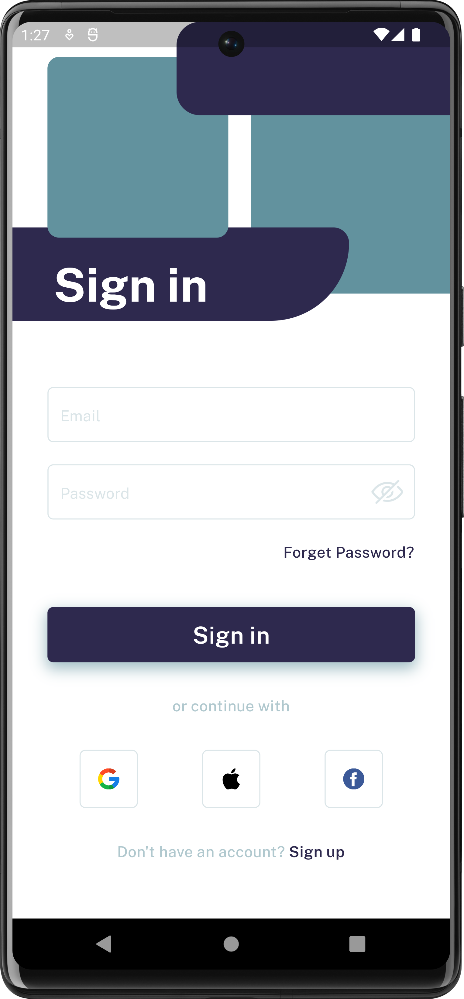
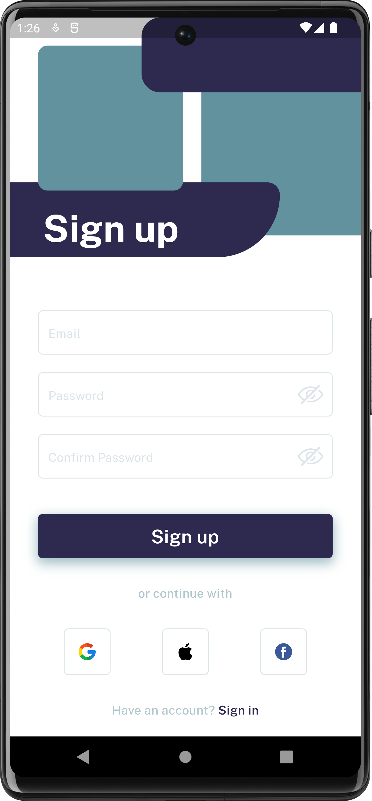

# Flutter Login and Signup App with Social Login Integration

## Key Features

### Login and Signup Screens
- **User-Friendly UI**: Easily log in to your account or create a new one.
- **Email and Password**: Use your email and password for the traditional approach.
- **Social Login**: Speed things up with one-click login using Google, Facebook, and more.

### Attractive User Interface
- **Stunning Design**: Our app boasts a modern and visually appealing design.
- **Custom UI Elements**: Unique and stylish UI shapes and elements make the app stand out.
- **Smooth Animations**: Enjoy seamless transitions and elegant animations.

### Customizable and Extensible
- **Built with Flutter**: Leverage the power of Flutter for customization and feature expansion.
- **Modular Architecture**: Easily tweak or add new features with our modular code structure.

---

## Screenshots

    
    

---

## Developer

<b><i>Rahil Shaikh</i></b>
 
 

Experienced Flutter developer with a demonstrated history of working in the information technology and services industry. Skilled in Mobile Application Development. Strong engineering professional with a Master of Computer Applications - MCA focused in Information Technology from Sarvajanik College of Engineering & Technology.

---

## Social Handles

    
    <a href="https://www.linkedin.com/in/raahilshaikh/">raahilshaikh</a>

 

    
    <a href="https://github.com/RaahilShaikh">raahilshaikh</a>

 

    
    <a href="mailto:rahils416@gmail.com">rahils416@gmail.com</a>

---